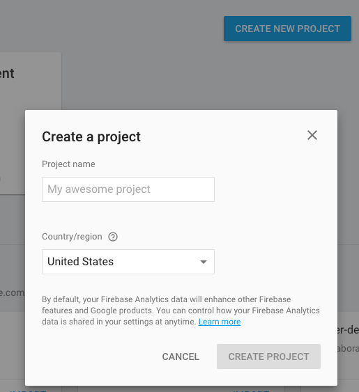
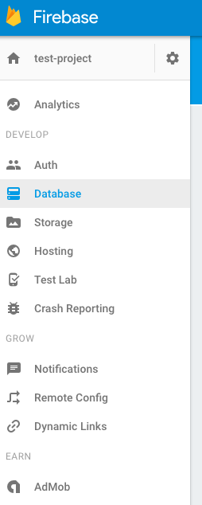
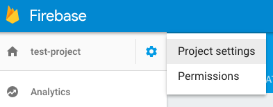
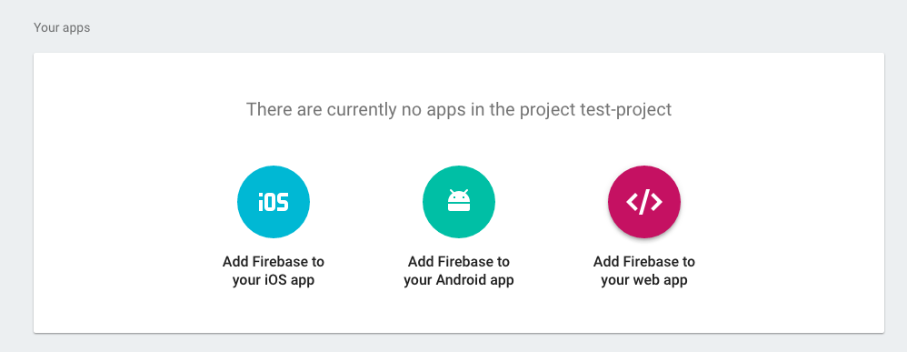
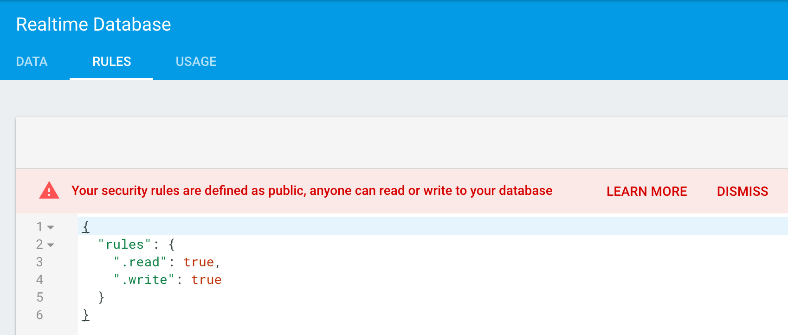
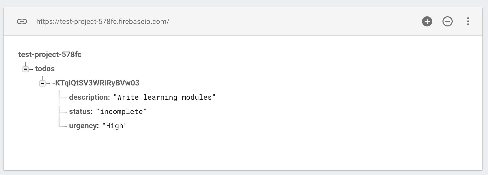

# Module 12: Introduction to Firebase

## Overview
Firebase is a _cloud hosted data service_ that we will use to store data for our web applications. Rather than write our own server-side scripts, we can leverage the firebase platform to manage our data. As a _real time_ database, Firebase will enable us to create interactive applications where users create, read, and share data (such as chat-rooms or multiplayer games).

<!-- START doctoc generated TOC please keep comment here to allow auto update -->
<!-- DON'T EDIT THIS SECTION, INSTEAD RE-RUN doctoc TO UPDATE -->

**Contents**

- [Resources](#resources)
- [Set-up](#set-up)
- [Data Structure](#data-structure)
- [Database Interactions](#database-interactions)
  - [Creating Data](#creating-data)
  - [Reading Data](#reading-data)
  - [Updating Data](#updating-data)
- [Firebase Storage](#firebase-storage)

<!-- END doctoc generated TOC please keep comment here to allow auto update -->

## Resources
- [Firebase Homepage](https://firebase.google.com/)
- [Getting Started](https://firebase.google.com/docs/web/setup)
- [Firebase Data Structure](https://firebase.google.com/docs/database/web/structure-data)
- [Reading and Writing to a Database](https://firebase.google.com/docs/database/web/read-and-write)
- [Create a Firebase Storage Reference](https://firebase.google.com/docs/storage/web/create-reference)

## Set-up
There are a few steps you'll need to take in order to get started using Firebase (more info [here](https://firebase.google.com/docs/web/setup)).

### On Firebase

First, you'll need to _Get Started_ by signing up for an account. Because Firebase is _owned by Google_, you'll be prompted to sign-in with (or create) a google account when you click here:


Once you've signed into your account, you'll want to navigate to your **console** where you can create a project:


From your console, you can click the _Create New Project_ button, which will prompt you to create a project, which you should give a short and descriptive name:



Once you've created a project, you can click on your project card to be navigated to your project interface at https://console.firebase.google.com/project/PROJECT-URL/overview. You can then navigate using the tab on the left to interact with specific parts of your project, such as the database:



### In Your App
Once you've set up a project your account, you'll need to link your web page to the Firebase project. This can be done in a few simple steps:

First, you'll need to load the Firebase library in the `<head>` section of your HTML file:


```html
<script src="https://www.gstatic.com/firebasejs/3.4.0/firebase.js"></script>
```

Then, in your JavaScript file, you should initialize your project:

```javascript
// Configuration: replace <THESE_VALUES> with your values from firebase
var config = {
    apiKey: "<API_KEY>",
    authDomain: "<PROJECT_ID>.firebaseapp.com",
    databaseURL: "https://<DATABASE_NAME>.firebaseio.com",
    storageBucket: "<BUCKET>.appspot.com",
};

// Initialize Firebase, providing you read/write access to the database
firebase.initializeApp(config);
```
To get the values for the `config` variable above, navigate to the _settings_ of your project from the Firebase menu:



From this location, you should click on _Add Firebase to your web app_ to access the `config` options for your project:



In order to read and write data to your database, you'll either need to authenticate your users (more on this in the next learning module), or change your **database rules**. To enable read/write access by _anyone_ (not necessarily suggested from a security standpoint), you'll need to navigate to the database/rules tab and enter the following code:

```javascript
{
"rules": {
  ".read": true,
  ".write": true
}
}

```

When you do this and click **Publish**, your should see the following screen:



You will now (finally) have access to your firebase database from your web application.

## Data Structure
In order to properly use Firebase as a data storage service, it's crucial to understand _how_ that data is structured. **All** of the data for a project is stored in the same JSON (JavaScript Object Notation) object. In other words, all of the data is stored in a single object (just as you would store information in an object in JavaScript). For example, if you had a simple to do list applicaiton, the data could be stored as follows:


```javascript
// All data is stored in the same object
{
    "todos":{
        "one":{
            "description": "Do INFO 343 Homework",
            "status":"Incomplete",
            "urgency":"Low"
        },
        "two":{
            "description": "Do INFO 474 Homework",
            "status":"Incomplete",
            "urgency":"High"
        }
    }
}
```

Data from your tree is accessed just like referencing information from an Object: using it's **key**. Object keys can be specified from your JavaScript file, or will be assigned automatically in Firebase. While we won't encounter any _huge_ data in this class, it's important to understand [best practices](https://firebase.google.com/docs/database/web/structure-data) for storing data, such as limiting the amount of nesting you do in your JSON Tree.

## Database Interactions
Now that we know how to set up a project on Firebase, connect to it in our JavaScript file, and have an understanding of the data structure, we can begin interacting with our data (JSON object). Because you'll often start off with an empty project, we'll begin by discussing how to _create_ data on Firebase.

### Creating a Database Reference
In order to perform any data action to our database, we'll first have to create a _reference_ to that data. A reference can point to the entire data structure, or a specific point in the JSON tree. For example, to point to the entire data structure, you can use the `firebase.ref` method:


```javascript
// Initialize Firebase, providing you read/write access to the database
firebase.initializeApp(config);

// Create a reference to the root of database
firebase.database().ref();

```

Firebase is intelligent enough to create _new_ child elements on the tree when you reference them for the first time:

```javascript
// Create a reference to a new child called "todos"
var todos = firebase.database().ref('todos');
```


### Creating Data
Once you have created a reference, you'll be able to store data in your database. The method for creating your elements will depend on your data structure, but let's imagine that our `todos` reference is supposed to have _multiple child elements_, each with key/value pairs explaining an item on a to-do list. To add a new item, you can specify the `push` method:

```javascript
// Create a reference to a new child called "todos"
var todos = firebase.database().ref('todos');

// Write a new item
// Push something into todos
todos.push({
    description: 'Write learning modules',
    urgency: 'High',
    priority: 'incomplete'
});
```

As soon as you execute that code, an child element will be added to the `todos` reference (which is a child of the _root_ element):




### Reading Data
When you create a reference to a Firebase data store, you can listen to changes to that part of your data structure. There are a variety of methods for listening to event changes, the first of which we'll introduce is `value`.

Setting an event listener on `value` will return the data _when the connection is made_, as well as any time that there is a change to the reference (include _all children_):

```javascript
// Create a reference to a new child called "todos"
var todos = firebase.database().ref('todos');

// Listen to changes to 'todos': will execute on connection, and on any change
todos.on('value', function(snapshot) {
    // Get the value of the data
    var data = snapshot.val();

    // Do whatever you want with the Object...
});
```

In the above code, `snapshot` contains a snapshot of the data structure at the time of the event. To retrieve the values _from_ the snapshot, the `snapshot.val()` method is invoked. This will return the data object with child elements of key/value pairs.

If there is data that you only need to read _once_, you can invoke the `once` method, which _will not_ listen to changes to the reference.

```javascript
todos.once('value').then(function(snapshot){
    // Get the value of the data
    var data = snapshot.val();

    // Do whatever you want with the Object...
})
```

### Updating Data
Using the _keys_ of particular objects, you can easily modify the contents of your Firebase database. First, let's consider how we can _get_ the keys of each element in our data store:

```javascript
// Listen to changes to 'todos': will execute on connection, and on any change
todos.on('value', function(snapshot) {
    // Get the value of the data
    var data = snapshot.val();

    // Iterate through key/value pairs
    Object.keys(data).forEach(function(key) {
        // Get value of object using key
        var value = data[key];

        // Create an element with the key as an ID
        var body = $('body');
        var button = $('<button>').attr('id', key);
        button.on('click', function() {
            // Get the key back from the button
            var key = this.id;

            // Update element
        });
        body.append(button);
    });
});
```
In the above example, we're keeping track of the key by storing it in the `id` of the `<button>` that we create. Then, in the `onClick` function, we're able to reference the `id` to reference the key of our data store.

To update our element, we will create a reference to it using the `child` method of the `todos` reference, and `set` the values:

```javascript
// Set the child value
todos.child(id).set({
    description: 'new description',
    priority: 'new priority',
    status: 'new status'
});
```
### Deleting Elements
Elements can be deleted using the `remove` method. Again, if you keep track of the `key` of each object, referencing (and removing it) is simple:

```javascript
    todos.child(id).remove();
```


## Firebase Storage
In addition to providing a realtime database, Firebase provides a **storage** service in which you can store documents such as images. While we used `firebase.database()` to reference the _database_ section of our project, we'll use `firebase.storage()` to return an object that points to our _storage_ section of a project. The syntax follows a similar structure for uploading images. However, before we can leverage the firebase functions, we'll need to use an HTML form to upload a document onto a webpage (then we can _push_ that document up to Firebase):

```html
<form >
  <input type="file">
</form>
```

**Input** elements with `type=file` create a button that will open up your file system and allow you to choose a file to upload into your application. We can make this a bit nicer using materialize:

```html
<!-- Leveraging materialize classes: from documentation -->
<form>
    <div class="file-field input-field">
        <div class="btn">
            <span>File</span>
            <input type="file" id="file-upload">
        </div>
        <div class="file-path-wrapper">
            <input class="file-path validate" type="text">
        </div>
    </div>
 </form>
```

The `<span>` element in the code section above will look like a button for you user, and the `<input>` element will display your uploaded form. This will enable your user to upload a file into your web browser. Once you have uploaded a file, you can select it using jQuery:

```javascript
// Get the first file of the uploaded files from the input element
var file = $("#file-upload")[0].files[0]
```

The next step is to take the file and push it up to Firebase's storage. This is best done in two steps. First, you'll need to create a **reference** to a particular point in your storage data structure (it's also a tree structure, though the UI is a bit different). You'll likely want to explicitly name your file so that it's easy to retrieve.

```javascript
// Create a Firebase storage object
var storage = firebase.storage();

// Create a reference to a particular filename
var fileRef = storage.ref('filename')
```

Once you've created a reference, you can use the `put` method to _put_ a file in the specified location:

```javascript
// Get the file
var file = $("#file-upload")[0].files[0]

// Put a file in the specified location, then do something on success
fileRef.put(file).then(function(){
    // Do something after the file has been uploaded
});
```

To retrieve elements from Firebase storage, you'll want to get the URL of the file location, then do something in the callback function:

```javascript
fileRef.put(file).then(function(){
    // Get download URL, then do something with it
    fileRef.getDownloadURL().then(function(url) {
        // Do something with the URL of your file
    });
});

```
Note, there is currently **no supported way** to listen to changes to Firebase storage, so you'll need to think of a thoughtful way to use it in conjunction with Firebase database if you want to track changes.

To practice uploading files to Firebase storage, see [exercise-2](exercise-2).
