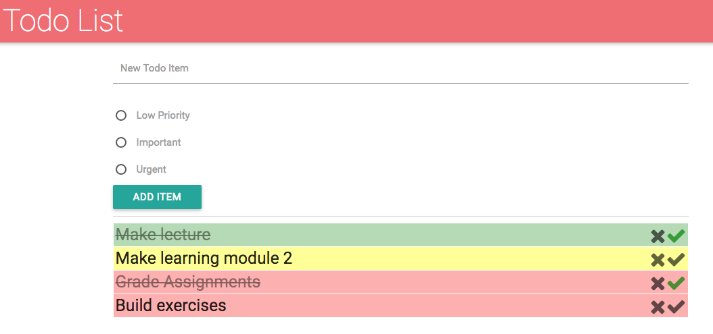

# Exercise-#
In this exercise, you'll practice DOING STUFF, and then it will look like:

As described in [module-4](https://github.com/info343c-a16/m4-git-intro), start by forking and cloning this repository. Then, DO STUFF
