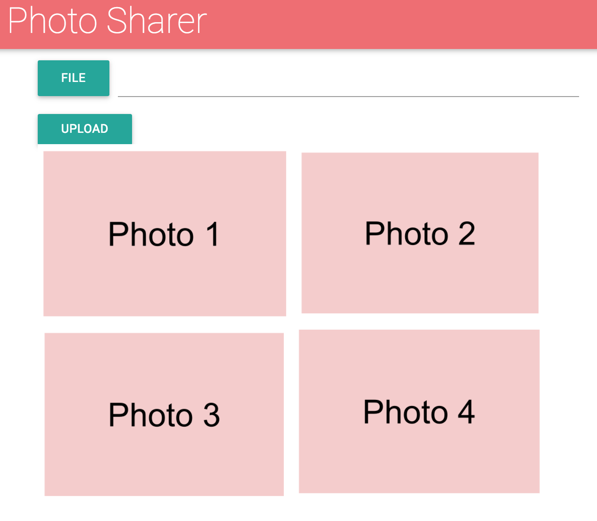

# Exercise-2
In this exercise, you'll practice leveraging the Firebase storage service to upload files to a remote server.

As described in [module-4](https://github.com/info343c-a16/m4-git-intro), start by forking and cloning this repository. Then, complete the following sections.

## Set up
Following the instructions in this learning module, set up (and connect to) a Firebase database. This includes:

**On Firebase**
- Create a Firebase account
- Make a new Project on Firebase
- Change the **database rules** to allow anyone to read/write to the database
- Change the **storage rules** to allow anyone to read/write to the database
- Get the authentication information from your settings (for use in JavaScript)

**In Your Scripts**
- In your `main.js` file, use the project configuration information to initialize a connection to Firebase

## Creating storage
For this exercise, you'll use need to build a simple form to collect information from your users. First, you'll need to do the following in your `index.html` file:

- Create a form in which you can upload a file

Then, in your `main.js` file, you'll need to do the following:

- Assign an **event listener** to your form in which you do the following:
    - Use jQuery to get the uploaded file from your form (see learning module)
    - Create a **new Firebase storage reference**, using the _name of your file_
    - Use the `put` method to put your file in your reference, `then`...
    - Use the `getDownloadURL` method to get the URL of where your photo is stored, `then`...
    - Push your filename into a **Firebase data structure** to track all of your filenames

## Reading Data
Now that we have a way to upload data, we'll need a way to show the uploaded files. We've already stored the **file URL** in our Firebase database, and we can use the information to create images. In your `main.js` file, you should

- Add an `.on('child_added')` to a reference in your **Firebase database** reference
- When a child is added, you should _**get the URL**_ of your file
- Using jQuery, create a new `` element with the URL as the `src` attribute
- Using jQuery, append your `` to your element with id `photos`
